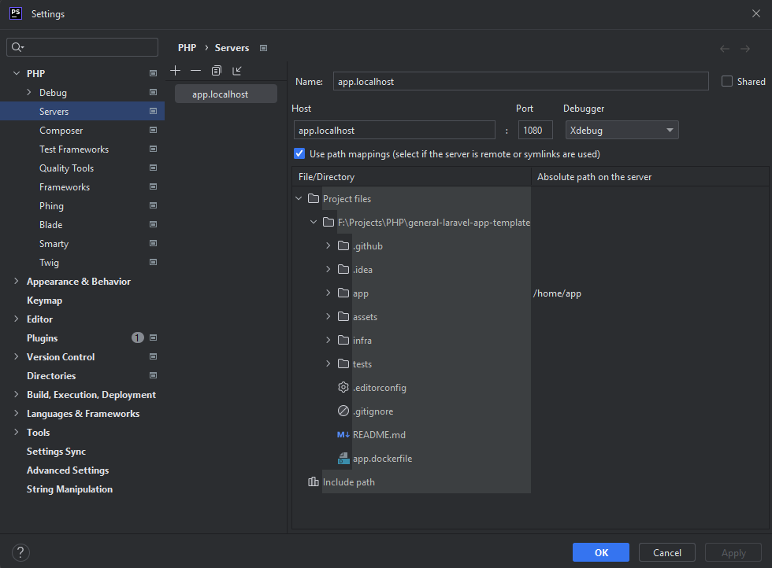

# General Laravel App Template
## Tópicos
- [Sobre](#sobre)
- [Instalação local](#instalação-local)
    - [Instalação manual](#instalação-manual)
        - [Pré-requisitos](#pré-requisitos)
        - [Passo-a-passo](#passo-a-passo)
    - [Instalação com docker](#instalação-com-docker)
        - [Pré-requisitos](#pré-requisitos-1)
        - [Passo-a-passo](#passo-a-passo-1)
- [Configuração](#configuração)
- [Execução de testes](#execução-de-testes)
    - [Testes unitários e mutantes](#testes-unitários-e-mutantes)
    - [Testes integrados](#testes-integrados)

## Sobre
- [Voltar](#tópicos)
- [Sobre](#sobre)

Template padrão para criação de aplicações PHP com Laravel. Consulte a [documentação da aplicação](./app/README.md) para saber mais detalhes.

## Instalação local
- [Voltar](#tópicos)
- [Instalação local](#instalação-local)
    - [Instalação manual](#instalação-manual)
        - [Pré-requisitos](#pré-requisitos)
        - [Passo-a-passo](#passo-a-passo)
    - [Instalação com docker](#instalação-com-docker)
        - [Pré-requisitos](#pré-requisitos-1)
        - [Passo-a-passo](#passo-a-passo-1)
        - [Debug com Docker](#debug-com-docker)

### Instalação manual
#### Pré-requisitos
Para a instalação desta aplicação em ambiente local, é necessário ter instalado em sua máquina os seguintes recursos:
- PHP 8.1
- Composer
- PHPStorm

#### Passo-a-passo
1. [Baixe e instale um servidor PHP 8.1.0 em sua máquina](https://www.apachefriends.org/pt_br/index.html).
2. [Baixe e instale a última versão do Composer em sua máquina](https://getcomposer.org/download/)
3. [Baixe e instale o PHPStorm em sua máquina](https://www.jetbrains.com/pt-br/phpstorm/download/#section=windows)
4. Clone o projeto com o seguinte comando:
   ```
   git clone https://github.com/FelipeMenezesDM/general-laravel-app-template.git
   ```
5. Na pasta raíz do projeto, execute o comando abaixo para baixar as dependências da aplicação via Composer:
   ```
   composer install
   ```
6. Abra o arquivo `.env` gerado na pasta _/app_ e configure as variáveis de ambiente conforme necessário.
7. Após isso, as chamadas dos endpoints podem ser realizadas para a URL local: [``http://localhost/general-laravel-app-template/app/public/api/v1``](http://localhost/general-laravel-app-template/app/public/api/v1)

### Instalação com docker
#### Pré-requisitos
Para a instalação em ambiente local desta aplicação usando Docker, você deve possuir os seguintes programas instalados em sua máquina:

- Docker
- Docker compose
- PHPStorm

#### Passo-a-passo
1. Clone o projeto usando o comando abaixo:
   ```
   git clone https://github.com/FelipeMenezesDM/general-laravel-app-template.git
   ```
2. [Baixe e instale a versão mais recente do Docker](https://docs.docker.com/desktop/install/windows-install/)
3. Na pasta raíz do projeto, execute o comando abaixo para baixar as imagens e criar os containers do Docker:
   ```
   PORT=1080 docker compose -f ./infra/docker-compose.yml up -d
   ```
4. Execute o comando abaixo para realizar a instalação da aplicação no container gerado:
   ```
   docker exec -it general_laravel_app_template sh -c "composer install && chown -R www-data: ."
   ```
5. Abra o arquivo `.env` gerado na pasta _/app_ do projeto e configure as variáveis de ambiente conforme necessário.
6. Após isso, as chamadas dos endpoints podem ser realizadas para a URL local: [``http://localhost:1080/api/v1``](http://localhost:1080/api/v1).

#### Debug com Docker
1. Acesse File > Settings > PHP > Servers e adicione um novo servidor com as seguintes configurações:<br>
   
   > ** Note **
   > 
   > É importante não esquecer de mapear corretamente o diretório _/app_ para _/home/app_
2. Inicie o listener do PHPStorm:<br>
   

## Configuração
- [Voltar](#tópicos)
- [Configuração](#configuração)

Por ser uma aplicação Laravel, suas configurações podem ser alteradas diretamente no arquivo **.env**, localizado no pasta _/app_.

## Execução de testes
- [Voltar](#tópicos)
- [Execução de testes](#execução-de-testes)
    - [Testes unitários e mutantes](#testes-unitários-e-mutantes)
    - [Testes integrados](#testes-integrados)

### Testes unitários e mutantes
Os testes unitários deste projeto podem ser executados usando diretamente o comando do Composer:
```
composer run test-unit
```

Para executar apenas os testes mutantes e gerar o relatório de cobertura, execute o comando abaixo:
```
composer run test-mutation
```

No docker, os comandos de teste podem ser executados da seguinte forma:
```
docker exec -it general_laravel_app_template sh -c "composer run test-unit"
docker exec -it general_laravel_app_template sh -c "composer run test-mutation"
```

### Testes integrados
As informações de execução dos testes integrados desta aplicação podem ser visualizadas diretamente na [documentação do pacote de testes](./tests/README.md).
